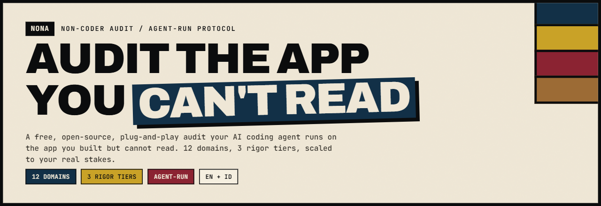
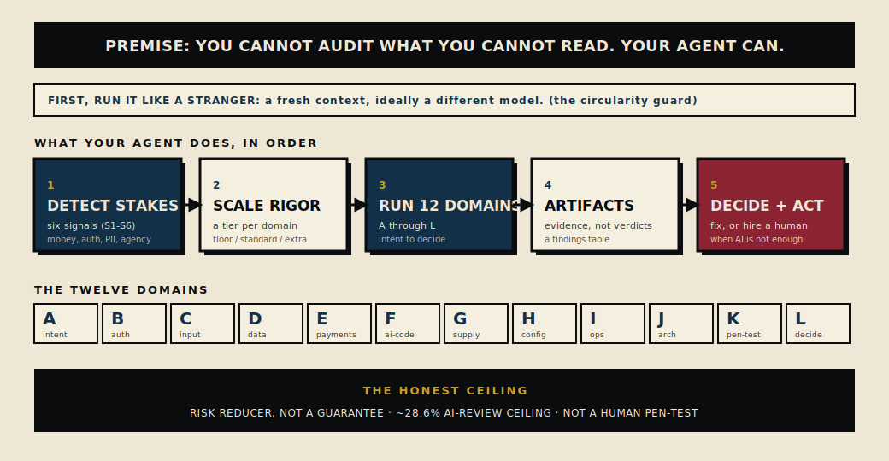

# NONA

**Audit Non-Coder. Audit gratis dan open-source yang dijalankan agen AI codingmu pada aplikasi yang kamu bangun tapi tak bisa kamu baca.**

> Non-coder tidak tahu apa yang mereka tidak tahu. NONA adalah audit keamanan yang tak akan pernah bisa mereka tulis sendiri, dijalankan oleh agen yang bisa.

[](../LICENSE)
[](#apa-itu-nona)
[](#apa-itu-nona)
[](#cara-kerjanya)
[](../README.md)

Edisi bahasa Inggris: [../README.md](../README.md)

Kamu merilis sesuatu dengan Lovable, Cursor, Bolt, Replit, v0, Claude Code, Codex, Windsurf, Copilot, Antigravity, atau alat AI coding lain. Ia jalan. Orang mulai memakainya. Dan kamu tidak punya cara nyata untuk tahu apakah ia aman, karena kamu tidak bisa membaca kodenya, dan jenis AI yang sama yang menulisnya akan dengan senang hati bilang ke kamu bahwa semuanya beres. NONA menutup celah itu. Kamu jatuhkan ia ke dalam proyekmu, agen AI-mu sendiri yang menjalankannya, dan kamu dapat balik sebuah laporan dalam bahasa biasa: apa yang bisa menyakiti bisnismu, apa yang diperbaiki lebih dulu, dan satu momen ketika kamu sebaiknya berhenti dan membayar seorang ahli manusia.

NONA berlisensi CC-BY-4.0. Ia teks polos yang bisa kamu baca sendiri sebelum kamu memercayainya. Lihat catatan keamanan satu baris di bagian bawah.

## Apa itu NONA

Inilah masalah yang membuat NONA dibangun. Orang non-coder yang merilis aplikasi dengan alat AI tidak tahu apa yang dia tidak tahu. Kamu tidak bisa bertanya ke agen-mu "kodeku aman, nggak?" lalu memercayai jawabannya, karena kamu tidak tahu pertanyaan apa yang akan diajukan seorang engineer yang teliti, dan kamu tidak bisa menanyakan ke agen-mu pertanyaan yang belum pernah kamu dengar. Jempol dari alat yang sama yang menulis kodenya bernilai sangat sedikit.

NONA adalah daftar periksa yang dibawa engineer teliti itu di kepalanya, ditulis hitam di atas putih. Ia memegang pengetahuan audit yang sudah dimiliki seorang engineer berpengalaman, pengetahuan yang sama yang bisa dijalankan agen AI-mu begitu ia diberi tahu apa yang harus dicari. Seluruh intinya: audit tidak pernah terhambat oleh apa yang kebetulan kamu ketahui. Kamu tidak perlu tahu apa yang harus ditanyakan. NONA sudah menanyakannya, menggantikanmu, dan menyerahkan pertanyaan-pertanyaannya kepada agen-mu.

Ia mencakup dua belas bidang, diberi huruf A sampai L, dan di dalam tiap bidang ia tahu tiga kedalaman ketelitian: floor (dasar), standard (standar wajar), dan extra-mile (upaya lebih). Cakupannya menyeluruh dengan sengaja, sampai ke praktik yang bahkan tim engineering kuat perlakukan sebagai usaha tambahan. Ia tetap cerdas alih-alih boros dengan membaca seberapa besar yang sungguh dipertaruhkan di proyek spesifikmu lalu menaikkan ketelitian hanya di tempat yang risikonya memang pantas. Aplikasi pembayaran-dan-login dengan agen AI yang bertindak sendiri pantas dapat pemeriksaan garis terdepan. Daftar tugas akhir pekan pantas dapat floor saja. Bingkai yang jujur: NONA adalah lapisan penerjemahan dan pemilihan di atas otoritas keamanan yang nyata, disebut namanya, dan bertanggal, dikemas supaya agen-mu bisa menjalankannya. Ia tidak menghasilkan riset keamanan orisinal, dan ia tidak berpura-pura begitu. Tiap pemeriksaan floor dan standard berujung pada kontrol terbit yang bisa kamu cari sendiri.

Apa yang bukan NONA: sebuah situs web yang kamu kunjungi lalu menempelkan hasilnya kembali, daftar periksa keamanan-saja yang datar, atau pengganti seorang ahli manusia ketika taruhannya tinggi. Ia adalah audit menyeluruh yang dijalankan agen-mu sendiri secara gratis, dan ia jujur soal di mana batasnya berada.

## Audit dalam satu layar



## Untuk siapa

Untuk kamu, kalau kamu membangun dan merilis aplikasi dengan alat coding AI dan tidak bisa membaca hasilnya. Kamu tahu apa yang seharusnya dilakukan aplikasi itu. Kamu tidak tahu apa yang bisa dilakukan orang asing terhadapnya, apa yang mungkin kamu bocorkan, atau apa yang diam-diam bisa menggelembungkan tagihan saat kamu tidur. NONA ditulis dalam bahasa sehari-hari untuk pembaca persis seperti itu. Tiap istilah teknis dapat satu baris penjelasan biasa saat pertama muncul, dengan kata Inggrisnya dipertahankan (RLS, IDOR, webhook) supaya kamu bisa mencarinya nanti. Tiap risiko dinyatakan sebagai konsekuensi bisnis konkret, bukan label kode.

NONA juga ditulis untuk agen AI-mu, karena agen itulah yang menjalankannya. Dua pembaca berbagi satu dokumen: kamu bisa membacanya untuk paham apa yang diperiksa dan kenapa itu penting bagimu, dan agen-mu bisa membaca file yang sama lalu menjalankan tiap pemeriksaan.

## Cara kerjanya

### Jatuhkan ia ke dalam

Kamu tambahkan NONA ke proyekmu dan arahkan agen-mu padanya. Tiga cara melakukannya ada di bagian mulai-cepat di bawah. Kamu tidak mengonfigurasi apa pun, kamu tidak mendaftar, dan kamu tidak mengirim kodemu ke mana pun. Audit membaca kodemu di mesinmu sendiri dan melapor balik kepadamu.

### Agen-mu mendeteksi taruhannya

Sebelum memutuskan seberapa keras harus memeriksa, agen-mu membaca aplikasimu untuk enam sinyal taruhan. Sebuah sinyal taruhan adalah sifat konkret dan bisa dicek yang berarti sebuah kesalahan di bidang itu akan benar-benar menyakitkan.

- Uang: pembayaran, penagihan, pencairan dana, atau kredit yang bernilai uang sungguhan.
- Identitas dan login: akun, sesi, reset kata sandi, peran seperti user biasa lawan admin.
- Data pribadi: aplikasi menyimpan informasi tentang orang sungguhan, seperti email, nomor HP, nama, alamat, lokasi, atau pesan pribadi.
- AI yang bertindak sendiri: sebuah fitur AI di aplikasimu bisa mengirim, menjalankan kode, memanggil layanan, atau membelanjakan, tanpa kamu menyetujui tiap tindakan lebih dulu.
- Radius dampak: satu kegagalan akan menyakiti banyak orang sekaligus, karena ada banyak user, beberapa pelanggan terpisah di satu sistem, atau sebuah jalan masuk publik.
- Tidak bisa dibatalkan: sebuah tindakan tidak bisa diurungkan setelah terjadi, seperti penghapusan permanen, transfer, penerbitan, atau pengiriman.

Karena kamu mungkin tidak menggambarkan taruhan aplikasimu sendiri dengan akurat, agen-mu juga mengajukan beberapa pertanyaan ya-atau-tidak yang polos untuk menutup celah apa pun yang tidak dibuat jelas oleh kode. Membaca kode adalah sumber utama. Jawabanmu menangkap apa yang disembunyikan kode.

### Audit per-domain, bertingkat

Taruhan bersifat lokal. Ia menaikkan ketelitian hanya pada bidang yang ia sentuh. Uang di halaman checkout-mu membuat audit pembayaran jadi dalam, sementara perkakas uptime-mu, yang tidak menangani uang, tetap di tingkatnya yang lebih rendah. Untuk masing-masing dari dua belas bidang, agen-mu memilih satu dari tiga kedalaman:

- Floor: apakah ada yang mengerjakan hal yang sudah jelas? Garis dasar yang tidak bisa ditawar yang dibutuhkan tiap aplikasi, sekecil apa pun. Melewatinya adalah cara aplikasi dirilis dengan pintu terbuka lebar.
- Standard: apa yang dikerjakan tim yang kompeten, untuk bidang yang memegang sesuatu nyata seperti login atau data pelanggan.
- Extra-mile: garis terdepan, didapat hanya saat taruhannya membenarkan. Penetration testing adversarial yang mencoba membobol masuk, batas pengeluaran pada fitur AI, containment yang mengurung agen AI, threat modeling formal.

Beberapa kombinasi tidak bisa ditawar dan mengesampingkan hitungan. Aplikasi tempat sebuah agen AI bisa bertindak tanpa manusia menyetujui tiap langkah memaksa ketelitian garis terdepan pada keamanannya, pada tinjauan kode-buatan-AI-nya, dan pada rencana simulasi-serangannya. Panggilan AI berbayar apa pun yang berjalan di produksi memaksa batas pengeluaran sejak hari pertama, karena loop yang lepas kendali tanpa langit-langit bisa menguras anggaran dalam semalam. Aturannya berjalan ke arah sebaliknya juga: kalau aplikasimu tidak punya satu pun dari enam sinyal taruhan, agen-mu tidak boleh mengusulkan bug bounty, gladi chaos, atau target uptime formal. Merekomendasikan praktik kelas atas ke aplikasi taruhan rendah adalah kegagalan menimbang, dan NONA mengatakannya dengan lantang.

Satu floor kecil tidak pernah dilewati, bahkan pada taruhan nol: pakai aplikasimu seperti user sungguhan sebelum kamu merilisnya, jalankan scanner otomatis gratis yang menangkap secret yang bocor dan package berisiko, bicarakan "bagaimana ini bisa salah" sekali sebelum peluncuran, dan kalau kamu membuat panggilan AI berbayar apa pun, batasi pengeluarannya dan jalankan satu pemeriksaan dasar bahwa fitur AI itu berperilaku.

### Temuan kembali sebagai artefak, bukan vonis

Agen-mu tidak boleh sekadar bilang "kelihatannya aman". Ia harus menghasilkan daftar nyata secret yang ia temukan dan di mana letak masing-masing, peta nyata siapa bisa menjangkau apa, hasil nyata dari pengecekan apakah sebuah package yang disarankan AI-mu memang ada. Skor kepercayaan tanpa apa-apa di belakangnya menciptakan kepercayaan palsu, dan kepercayaan palsu justru kegagalan yang NONA ada untuk melawannya. Tiap bidang mengembalikan tabel temuan dengan lima kolom: seberapa serius ia, risiko bisnis dalam kata-kata biasa, bukti di belakangnya, kontrol terbit yang ia petakan, dan saran perbaikan. Pemeriksaan yang tidak menemukan apa-apa dilaporkan sebagai persis itu, sebuah ketiadaan temuan, yang belum sampai pada "aman".

### Ia memberi tahu kamu kapan harus menyewa manusia

Bidang terakhir mengumpulkan tiap temuan ke dalam satu tumpukan, memeringkatnya berdasarkan apa yang dibebankan sebuah kesalahan ke bisnismu, dan menerapkan aturan jelas tentang kapan audit AI sudah mencapai batasnya. Untuk aplikasi yang menangani uang, memegang banyak data orang, bisa mengambil tindakan yang tidak bisa dibatalkan, atau menjalankan agen AI sendiri, jawabannya adalah mendapatkan tinjauan manusia independen, dan NONA mengatakannya kepadamu secara tertulis. Untuk aplikasi yang berisiko sedikit, jawaban jujurnya adalah kamu tidak perlu membayar siapa pun. Tahu kamu yang mana itulah intinya.

## Dua belas bidang

- A. Verifikasi maksud. Apakah kode hanya melakukan yang kamu minta, dan melakukannya dengan aman. "Ia jalan" adalah klaim soal layar; "ia aman" adalah klaim soal apa lagi yang bisa kode lakukan ketika ada yang menekan-nekannya.
- B. Secret, akses, RLS, IDOR, auth. Inti keamanan: menjaga kunci tetap tersembunyi dan memastikan tiap user hanya menjangkau datanya sendiri. (RLS, row-level security, adalah aturan database yang membatasi baris mana yang boleh dilihat seorang user. IDOR, insecure direct object reference, adalah orang asing membuka catatan orang lain dengan mengganti sebuah angka di alamat web.)
- C. Input dan injection. Membersihkan semua yang masuk dari luar, termasuk prompt injection, yaitu teks bermusuhan yang disuapkan ke fitur AI aplikasimu sendiri lalu membajak apa yang ia lakukan.
- D. Data dan privasi. Bagaimana informasi pribadi disimpan, dijaga dari kebocoran, dan dihapus saat seharusnya.
- E. Pembayaran, monetisasi, dan integritas biaya AI. Menagih dengan benar, menghalangi tipuan tagihan, dan menghentikan pengeluaran AI yang lepas kendali (denial-of-wallet, di mana yang jadi sasaran adalah tagihannya, bukan server-nya). (Webhook adalah pesan otomatis dari server ke server yang mengonfirmasi sebuah peristiwa seperti pembayaran; webhook yang dipalsukan bisa memalsukan pesanan yang dianggap dibayar.)
- F. Pola kode buatan AI dan sirkularitas. Bidang khasnya: jenis AI yang sama menulis sekaligus mengaudit kode ini, jadi margin keamanan biasa berupa sepasang mata segar sudah hilang kecuali kamu membangunnya kembali dengan sengaja.
- G. Dependency dan supply chain. Kode pinjaman yang ditarik aplikasimu, dan risiko sebuah package yang tidak benar-benar ada atau ditanam supaya terlihat seperti package yang disarankan AI-mu (slopsquatting, di mana penyerang mendaftarkan nama package palsu yang cenderung dikarang oleh tool AI).
- H. Higiene config dan deploy. Salah-setel dan salah-rilis: kata sandi default yang dibiarkan menyala, kunci secret yang dikirim di dalam bagian publik aplikasi, security header yang hilang.
- I. Ops, uptime, backup, rollback. Menyadari saat sesuatu rusak, gagal dengan aman, dan bisa memulihkan serta mengurungkan.
- J. Kewarasan arsitektur. Apakah desain keseluruhan sehat: garis jelas antara apa yang tepercaya dan apa yang tidak, dan kerusakan dijaga tetap terkurung saat satu bagian gagal.
- K. Pen-test dan tinjauan profesional. Apa yang seharusnya diuji sebuah simulasi serangan sungguhan, dan batas atas yang jujur tentang apa yang bisa ditemukan AI yang memeriksa AI.
- L. Putuskan dan bertindak. Memilah temuan berdasarkan risiko bisnis, dan aturan jelas tentang kapan berhenti dan menyewa manusia.

Penalaran lengkap dan tabel pemeriksaan yang bisa dijalankan untuk tiap bidang ada di folder `protocol/`, mulai dari `protocol/00-overview.md`.

## Pasang dan mulai cepat

Pilih pintu depan yang cocok dengan alatmu. Ketiganya menjalankan audit yang sama. Tidak satu pun mengirim kodemu ke mana pun.

### Opsi 1: jatuhkan `AGENTS.md` (jalan dengan kebanyakan agen coding)

Salin file `AGENTS.md` dari repository ini ke root proyekmu, bersebelahan dengan file-file lain yang sudah dibaca agen-mu. Lalu buka agen-mu dan minta ia mengaudit aplikasi, dengan kata-kata apa pun ("audit aplikasiku", "ini aman untuk dirilis nggak", "cari apa yang bisa salah"). `AGENTS.md` adalah tulang punggung yang berdiri sendiri: ia membawa seluruh protokol dalam bentuk ringkas dan mengarahkan agen-mu ke file `protocol/` yang lebih dalam untuk bidang apa pun yang membutuhkannya.

### Opsi 2: pasang Claude skill

Untuk Claude Code, pasang skill di bawah `skills/nona-audit/`. Begitu ia di tempatnya, mulai chat baru lalu jalankan:

```
/nona-audit
```

Itu seluruh pemicunya. Kamu bisa mempersempitnya kalau mau (`/nona-audit B` mengaudit satu bidang lewat hurufnya, `/nona-audit confirm` menjawab pertanyaan taruhan lebih dulu), tapi tanpa apa pun setelahnya agen mengaudit seluruh proyek. Memulai chat baru itu penting di sini, dan bagian berikutnya menjelaskan kenapa.

### Opsi 3: adapter Cursor

Untuk Cursor, salin `adapters/cursor/nona.mdc` ke folder `.cursor/rules/` proyekmu. Ia disetel untuk berjalan hanya saat kamu memintanya, bukan di tiap penyuntingan. Lalu minta agen Cursor mengaudit, meninjau, atau memeriksa-keamanan proyeknya.

Satu catatan yang berlaku untuk tiap opsi: jalankan audit di sesi yang bersih dan baru yang tidak punya ingatan soal bagaimana kode dibangun. Tinjauan yang dimulai di sesi terpisah menangkap bug serius secara terukur lebih banyak daripada tinjauan yang dijalankan di chat yang sama yang menulis kodenya, dan model AI yang berbeda lebih baik lagi, karena model dari keluarga yang sama cenderung berbagi titik buta yang sama. Ini adalah hal termurah yang bisa kamu lakukan untuk membuat audit layak dipercaya, dan `protocol/02-circularity-guard.md` milik NONA menjelaskan metodenya secara lengkap.

## Ringkasan bukti, dengan catatan yang menjaganya jujur

NONA bertumpu pada pengukuran terbit, bukan pada klaim. Baca catatan kehati-hatian sebagai bagian dari tiap angka.

Temuan intinya adalah kode yang berfungsi belum tentu kode yang aman. Pada satu set 200 tugas coding realistis di tingkat repository, sebuah agen AI yang dipasangkan dengan model garis terdepan menghasilkan kode yang 61% benar secara fungsional tapi hanya 10,5% aman, dan menambahkan petunjuk "buatlah aman" ke permintaannya tidak memperbaikinya (studi SUSVIBES, arXiv:2512.03262, Desember 2025). Bagian terakhir itulah kenapa instruksi samar ke agen-mu tidak cukup dan audit terstruktur, pemeriksaan demi pemeriksaan, yang cukup. Sebuah studi akademik terkendali yang terpisah menemukan bahwa orang yang memakai asisten coding AI menulis kode yang kurang aman dan lebih cenderung percaya kode itu aman (Perry dkk., ACM CCS 2023). Pemeriksaan manusia salah-kalibrasi ke arah terlalu yakin justru saat AI terlibat, dan itulah alasan NONA menyerahkan kepadamu bukti yang bisa kamu lihat alih-alih skor kepercayaan yang harus kamu telan begitu saja.

Seberapa luas ketidakamanan itu bergantung pada bagaimana kamu mengukurnya, dan jawaban jujurnya adalah sebuah rentang, bukan satu angka menakutkan. Studi sebuah vendor keamanan komersial (angka vendor, disertakan karena ia menunjuk ke arah yang sama dengan kerja independen) menemukan bahwa 45% sampel buatan-AI memperkenalkan kelemahan yang dikenal, dengan angkanya datar terlepas dari ukuran model (Veracode, Juli 2025). Pemindaian independen yang lebih besar atas 7.703 file buatan-AI sehari-hari menemukan angka yang jauh lebih lunak, 12,1% membawa kelemahan terpetakan (Schreiber dan Tippe, arXiv:2510.26103, Oktober 2025). Keduanya benar. Bedanya ada di desain: angka yang mengkhawatirkan datang dari tugas terkurasi yang peka-keamanan, yang justru permukaan yang NONA sasar, sementara angka yang lebih lunak menghitung kode biasa secara luas. Sajikan keduanya bersama. Pemindaian vendor terpisah atas 5.600 aplikasi buatan-AI yang bisa dijangkau publik melaporkan lebih dari 2.000 kerentanan, lebih dari 400 secret terekspos, dan 175 kasus data pribadi yang bocor termasuk rekam medis dan rekening bank, dan karena pemindaian itu tidak merusak apa pun, itu adalah hitungan batas-bawah (Escape.tech, Oktober 2025, juga angka vendor).

Soal metode yang dipakai NONA sendiri, buktinya nyata dan berbatas. Sebuah institusi kredibel menamai masalah intinya dengan bersih: ketika kelas AI yang sama membangun dan menguji, "agen penguji mewarisi kelemahan yang sama dengan agen pengkode" (Stanford Law CodeX, Februari 2026). Sebuah eksperimen langsung lalu menunjukkan bahwa meninjau di sesi yang segar dan terpisah mengalahkan meninjau di chat yang sama, dengan keuntungan terbesar pada error kritis, dan bahwa pass kedua di sesi yang sama hampir tidak membeli apa-apa, yang mengisolasi pemisahan konteks sebagai hal yang membantu (Cross-Context Review, arXiv:2603.12123, Maret 2026). Eksperimen yang sama menetapkan batas atasnya, yang ada di bagian berikutnya.

## Batas yang jujur

NONA mengurangi risiko. Ia tidak menjamin keamanan. Melebih-lebihkannya akan menyerahkan kepadamu persis rasa aman palsu yang membuat aplikasi buatan AI dibobol, dengan cap berpenampilan resmi di atasnya, yang lebih buruk daripada tidak ada audit sama sekali karena kamu lalu berhenti waspada.

- AI yang memeriksa kode buatan AI menangkap sepotong berarti dari bug serius dengan murah, dan melewatkan sebagian besar error yang ditanam saat ia bekerja sendiri. Dalam pengukuran terbersih yang tersedia, bahkan kondisi terbaik, yaitu konteks segar yang terpisah, hanya menangkap sekitar 28,6% error yang ditanam menurut skor gabungan dari bug yang ditemukan dibanding alarm palsu yang dibunyikan (Cross-Context Review). Kira-kira tujuh dari sepuluh selamat. Itu lewat-pertama yang berguna dan titik mulai yang sungguh lebih tinggi. Ia bukan jaminan keamanan.
- Audit AI bukan penetration test profesional. Penetration test adalah seorang ahli manusia berbayar yang secara aktif mencoba membobol aplikasimu yang sedang berjalan. Menambah model AI kedua memperbaiki peluangnya tapi tidak mengubah hasilnya menjadi itu.
- Aplikasi bertaruhan tinggi (uang sungguhan, banyak user, aksi yang tidak bisa dibatalkan, agen AI yang bertindak sendiri) tetap sebaiknya membayar tinjauan manusia independen. Tugas NONA adalah memberi tahu kamu hari ketika kamu sudah melewati garis itu, di Domain L, bukan berpura-pura kamu belum.
- Sebagian angka utama yang mengkhawatirkan datang dari vendor yang punya insentif untuk menakut-nakuti. Di tempat sebuah angka adalah angka vendor, proyek ini menandainya begitu dan menyitir penyeimbang akademik independen di sebelahnya. Kumpulan bukti lengkapnya, dengan tiap sumber dan catatan kehati-hatian, ada di `docs/why-nona-exists.md`, dan standar di balik tiap pemeriksaan dipetakan di `CITATIONS.md`.

## Lisensi

NONA berlisensi ganda. Protokol dan seluruh teksnya (`protocol/`, `AGENTS.md`, `CITATIONS.md`, `SECURITY.md`, `docs/`, file README, dan edisi Indonesia di `id/`) memakai [Creative Commons Attribution 4.0 International](../LICENSE), CC-BY-4.0: pakai, bagikan, dan adaptasi dengan kredit. Kodenya (tool interaktif di `index.html` dan `assets/`, serta MCP server di `mcp/`) memakai [Lisensi MIT](../LICENSE-CODE). Keduanya mengizinkan penggunaan komersial.

## Keamanan

NONA sendiri adalah file yang dicerna agen-mu sebagai instruksi tepercaya, jadi ia dibangun untuk menjadi tautan yang aman dan untuk dibaca sebelum dijalankan; panduan integritasnya, termasuk cara memverifikasi bahwa salinan yang kamu punya asli, ada di `SECURITY.md`.
